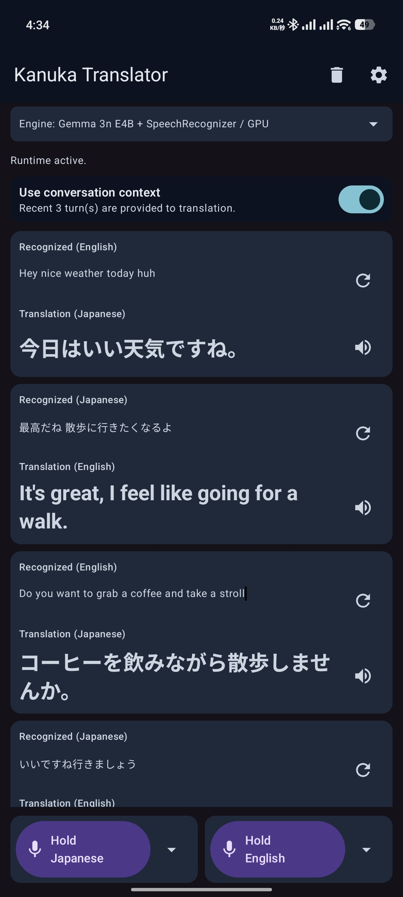
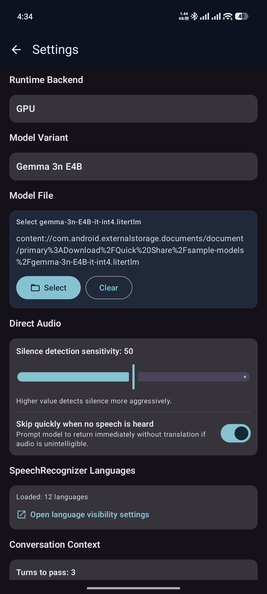

# Kanuka Translator

Offline Android speech translation app using Gemma 3n E4B.

## Screenshots

| Main                         | Settings                     |
| ---------------------------- | ---------------------------- |
|  |  |

## Supported Model
- [gemma-3n-E4B-it-int4.litertlm](https://huggingface.co/google/gemma-3n-E4B-it-litert-lm/blob/main/gemma-3n-E4B-it-int4.litertlm)

## Tested Device

- Xiaomi 15
  - Android 16
  - 12GB RAM
  - Snapdragon 8 Elite

## Current Docs
- App behavior/spec: `SPECIFICATION.md`
- Model setup: `MODEL_SETUP.md`

## License

MIT
